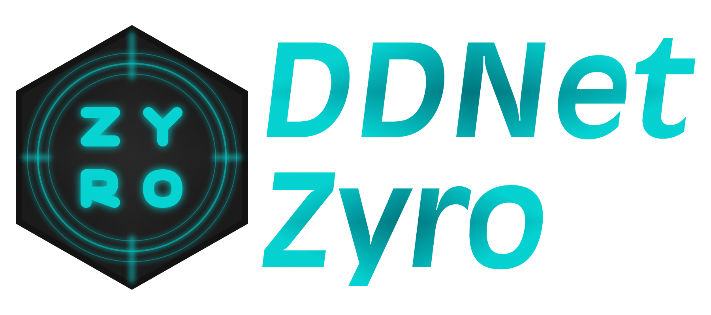

  

# Zyro

Zyro is a cheat for DDNet that is still in development. The main focus of this cheat is to be a simple and easy-to-use cheat for DDNet, with a focus on making the codebase as clean as possible, so it's easier to understand and modify.

# Contributing

If you would like to contribute to this project, please feel free to fork the repository and create a pull request.

# Licence

This project is licenced under the MIT Licence with Attribution Requirement. See the [LICENSE.md](LICENSE.md) file for details.

# Credits

- [DDNet](https://github.com/ddnet/ddnet)
- [Teeworlds](https://github.com/teeworlds/teeworlds)
